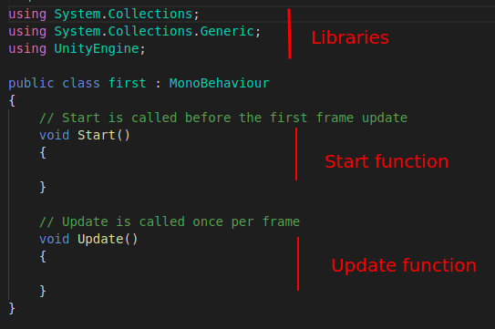
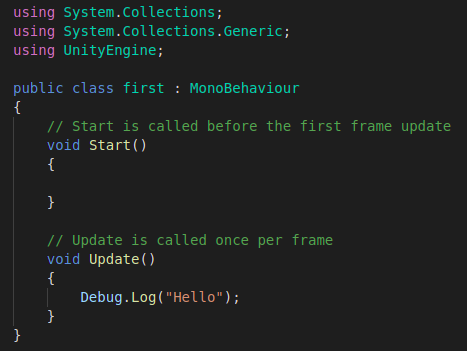
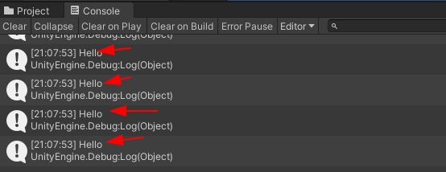
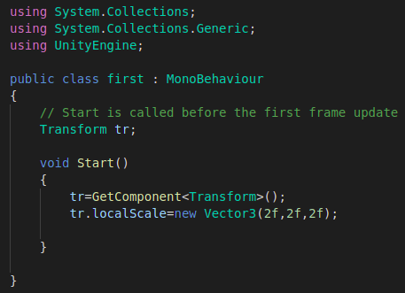
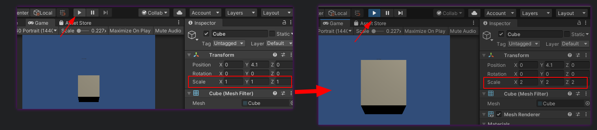
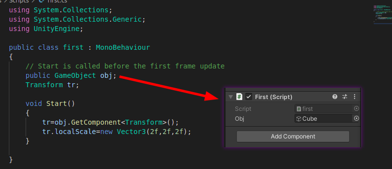

## Let's see the scripting 

So the first legit question could be why we always need to do coding X) to do cool things. Simple answer is that to make the cool projects you need cool functionalities which are managed by the code you write :) pretty lame I know.

Coding or what we call scripting in Unity is done using the C# (C Sharp) language and expects you to have a good knowledge of concepts like OOPs (Object Oriented programming). I highly recommend to learn these concepts using your favourite language, learning it using C# will provide you extra edge but if you are a complete newbee to coding I recommend to start with C++ adn then after a month or two switch to C#.

`ProTip:` Make Google your best friend and buy some chocolates to calm you down in case your consol logs shows error.

> Let's Begin

Now each GameObject(box, camera, lights etc) has some properties like transform, rigidbody and many more which we call components of a GameObject. We can change the properties of these components directly from inspector window. Let's say we want our cube GameObject to scale two times so we went to transform section and made the changes to inspector window. 

Let's re-think the same and consider that cube as our Player and at the time of playing the game whenever this player eats apple(also a GameObject) it scales up two times. So to achieve this functionality we use scripting i.e. doing the changes in gameobjects during Runtime.

Let's add our first script:

`Right Click -> Create -> C# Script -> Rename the script to your choice`

Now Double Click on the script and open it.We'll be greeted with this basic structure.

Now the `Start` function as the name suggest runs once during the initialization of the game/scene. This function is best place to set the initial positions for GameObjects. While `Update` function runs everytime the screen is refreshed. ForEx: A 60 FPS screen refreshes a screen 60 times in one second so anything inside update() will execute 60 times in one second.

> Hello World Of C#

Now let's do a simple hello world using `Debug.log()` function. Open the C# script and do as shown below and save it.

Now a point to note is you will not see the script doing anything untill unless you attach it to some game object(any gameobject) which is included in the scene.

To attach the script to gameobject just click on the object and in the inspector panel click `Add Components` and search he name of your script and you are done.

Now Click on play button and gead over to console tab to see Debug.Log.

Since we have added the `Debug.log` inside Update() therefore it's showing it so many times and if we have instead add Debug.log code only in Start() it would have shown us only once.

> What about accessing components of GAmeObjects

So here I'am about to reveal the real usage of scripting in unity. How to access components using scripts.

## Method 1 : 

> Accessing the component of the GameObject on which the scrirt is added

Let's say we want to increase the scale of our cube object so we create a new scrpt and assign it to the cube then we do the scripting as follows.

So in this we first create a variable named tr of type Transform. GetComponent<Transform>(); helped us accessing the Transform component and assigned those to tr and in the end using tr.localScale we accessed Scale parameter and assigned it a new Vector3. Simple so now when we start our game then the scale of the cube will increase it's size.

## Method 2 :

> Accessing the component of the GameObject when script is added to another Gameobject

Let's say I have decided to create an empty object and assign my script to it. Now is there a way I could access the component of other gameobject. Answer is "Yes". Let's create a new script and assign it to an empty game object and make changes in script as follows:

So here what we did is that we created a public variable Obj of type GameObject which will create the input field in the inspector panel of emptygameobject to which we assigned our script. Now we drag and drop the object(in this case cube) to the obj field in inspector panel. obj.GetComponent<Transform>(); will allow access to Transform component of obj(i.e. cube) via use of tr. Rest steps are same.

Now if you run the scene same changes can be seen.

For Scripting part of Unity I recommend reading the official [documentation](https://docs.unity3d.com/2019.3/Documentation/Manual/ScriptingSection.html) of Unity and also see the free video lecture [course](unity3d.com/learn) by unity.

