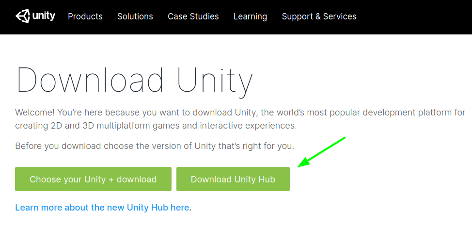
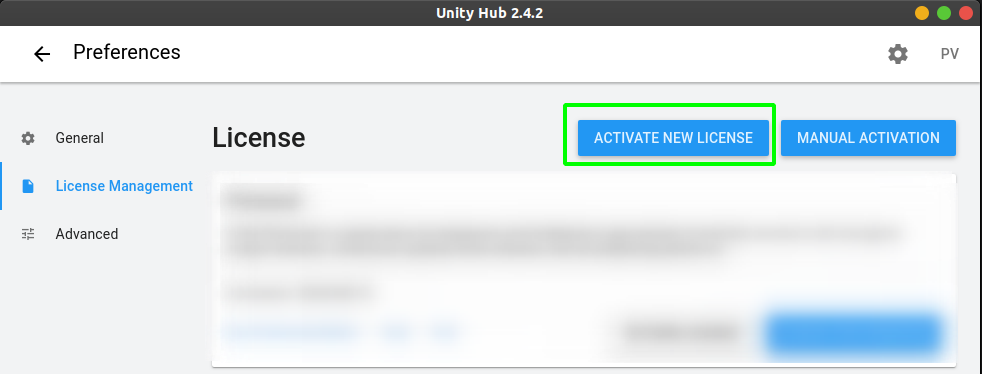
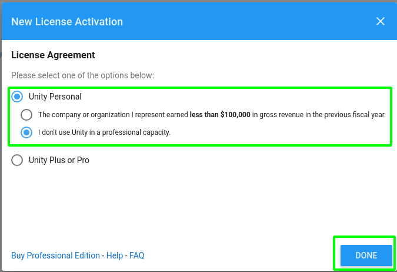
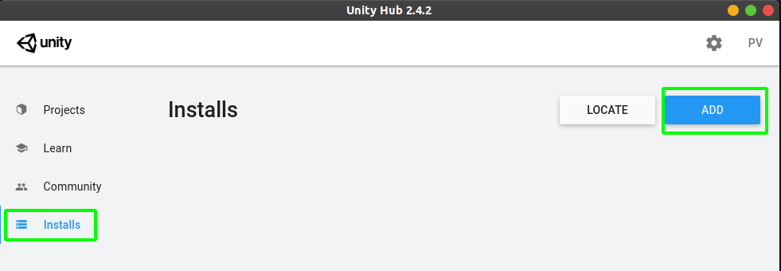
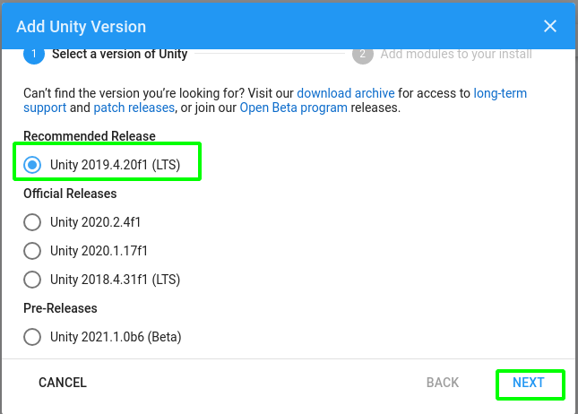
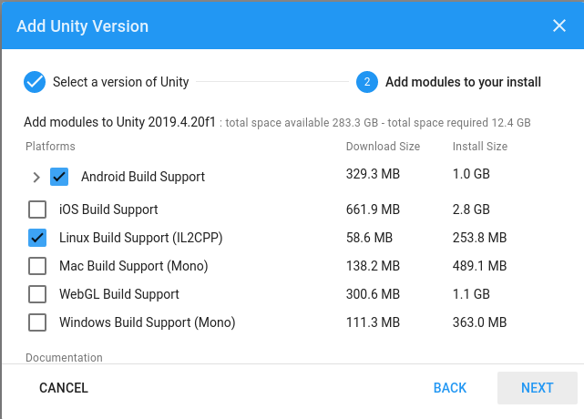

## Installing Unity and Dependencies

First of all we need to setup the infrastructure and other necessary dependencies for smooth running of Unity.

> Installing Unity Hub

1. **Download Unity Hub**[(https://unity3d.com/get-unity/download)].

   You can consider Unity Hub as the one stop portal for downloading Unity with it's dependencies.

2. **Activating Lisense**
   
   After installation of Unity hub it's time to activate lisence. For the development process we have to add a lisense of Unity to Unity hub.

   Step 1. Activate new license

   Step 2. Unity Personal and Done

3. **Download Unity lts(long term support) version.**
   
   After installing Unity hub on your machine it's time to install Unity and other dependencies. We should always install **lts** version as it provides the support for next 5 years from the year of it's release. In my case I'll be installing 2019.4.20f1.

   Step 1. Visit Installs panel and ADD

   Step 2. Selecting the lts release

   Step 3. Selecting the modules. 
   
   I'am on Linux so I have to get Linux Build Suport.

   Step 4. Accept the user agreement and done.

4. **Installing VSCode as our code editor.**

   Visit this quick video to install VSCode : [Link](https://www.youtube.com/watch?v=QXzYV3miuy4)

   You can also install [Visual Studio](https://visualstudio.microsoft.com/) as it's the official code editor for Unity. But since I'm running on Linux Visual Studio is not present for that platform.

    You can also visit [Link](https://www.youtube.com/watch?v=eHgh50G1E2A) to watch full installation video. Credits XoRphilic

And we are done with the initial setup it's time to [Understanding Interfaces](../Interface/README.md) 
