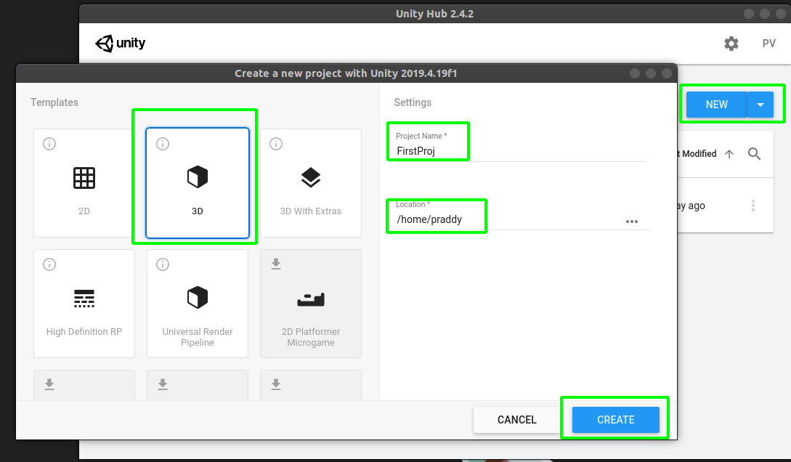
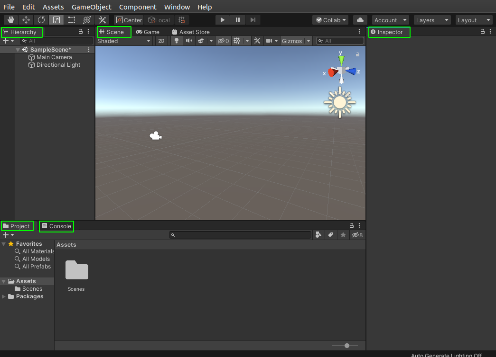
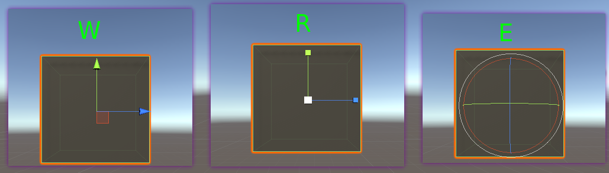
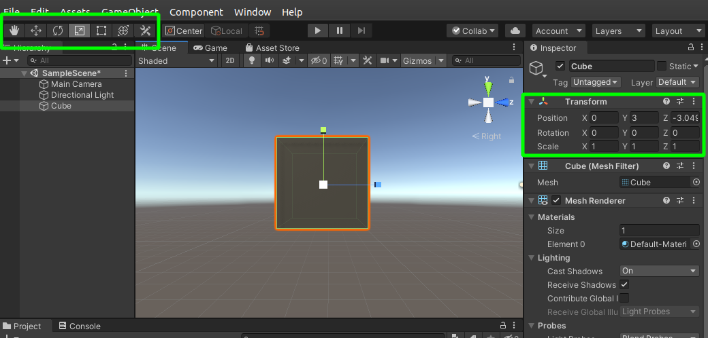
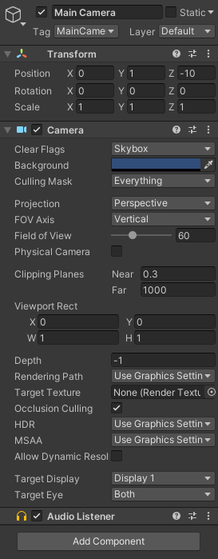
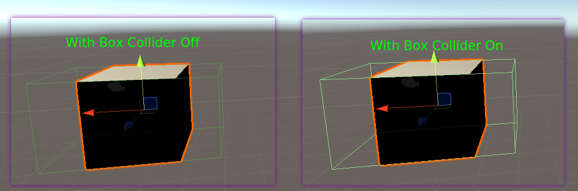

# Understanding Interface

It's time to fireup our project. So when you launch unityhub icon we need to create a simple 3D strting template.

On creation of new project you'll be greeted with the default interface of unity.

I will not be telling you the names of various panels as it's mentioned on the top of each panel(as highlighted by green boxes).

> Navigation Keys

"The better you navigate the better you can create". Let's learn the hot keys and shortcuts to navigate in scene panel.
    - **Middle-Mouse drag** : To drag the view
    - **Middle-Mouse Scroll** : To zoom in and out
    - **Right-Click drag** : To rotate 
    - **Hold Right-Click + W|A|S|D** : To do walk navigation

These things will help you navigate better during the whole work. ry and play with these hot keys to get acoustomed.

> Modifier Keys

When we need to drag, relocate or resize game objects we need to know about these modifier keys.Click on any game object listed in Hierarchy panel and use these keys:
    - **W** : Move Tool
    - **E** : Rotate Tool
    - **R** : Scale Tool

The same changes can be done from two places after selecting the object

> Main Camera

Camera sees the things which our enduser will be seeing and we can use any number of cameras in scene.

Let's understand its properties as shown in inspector panel(In case of Built-in Render Pipeline):

-**Tag** : Tag can be assigned to one or more gameobject which help us to access that group under that tag during scripting. For ex:All the collectable in a game can be tagged as collectables.
-**Layer** : It enable us to group gameobjects under layer name and then uses Culling Mask option to render those layers only from a scene.
-**Clear Flags** : Determines what will be the background type. By default it's skybox but sometime we also use solid colour.
-**Background**  : After all the game elements are rendered then the left-out places are filled with this colour(in absence of Skybox)
-**Culling Mask** : We can use it to ommit the rendering of any specific onjects by camera.(i.e. ho ke bhi render nahi hoga)
-**Clipping Planes** :  Describes the distance from camera to start or stop rendering.(Think of games where buildings appear after we move in that direction)

> Inserting a GameObject

  Use right click to see the Game objects we can add to the game.

> Properties of GameObject

  1. **Box-Collider** :  It act's as the actual boundary of the game  object 

  

  2. **Rigidbody** : We add it as component. It adds physics to the RigidBody.

  

  If you need detailed documentation then do visit the official [documentation](https://docs.unity3d.com/Manual/) by Unity.