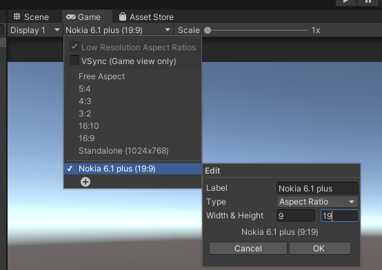
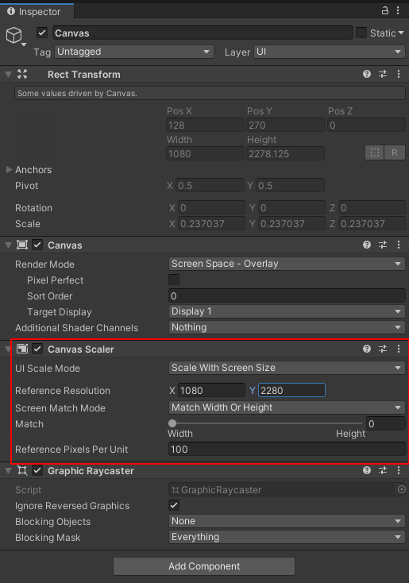
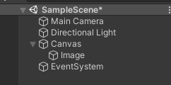
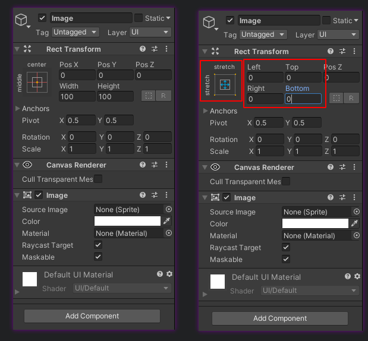
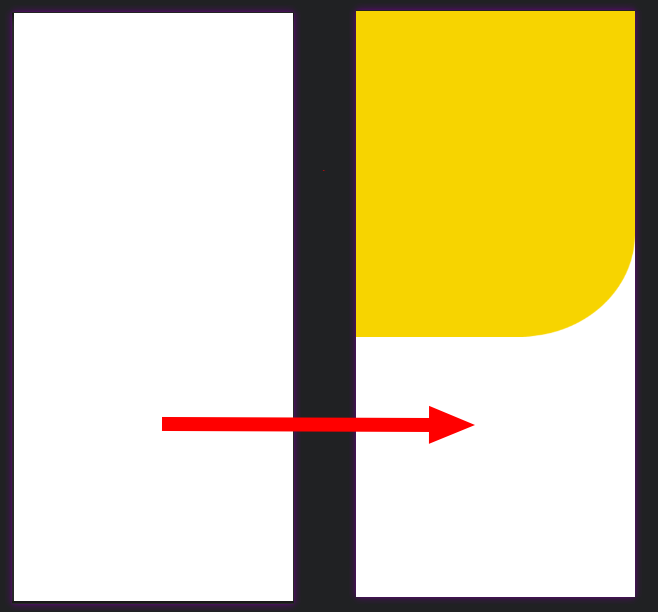
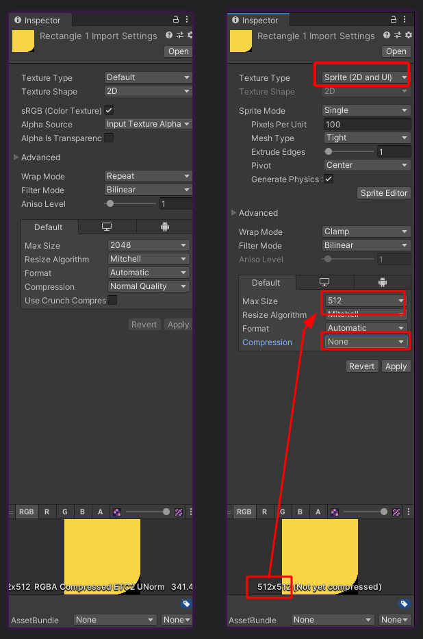
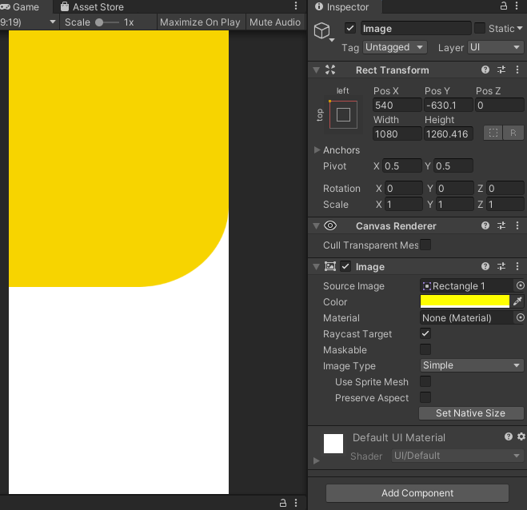

# Understanding UI

Before we start making our awesome UIs it's really important to understand some basic concepts and best practices. According to me you need answer to a question:

   - What will be the resolution of the device? Find [here](https://screensiz.es/phone)

> Setting Up our Resolution

Visit `Game Tab` and add the aspect ratio of your device.

Now let's add the UI element(Canvas) to our `Hierarchy panel` and let's see the properties panel.

We just nee to make changes in **Canvas Scalar** part.
    
   - UI Scale Mode : Scale with Screen
   - Reference Resolution : Input the resolution of your target device.

Now we are set with Canvas and we should focus now on each individual entity.

> How to add the UI Elements?

It's easy to add the UI elements if you know how to do it actually. I expect you have followed the above instructions and already added the resolution of target device.

Adding UI elements takes 3 steps:

1. Add Image from UI Tab.
2. Give it proper anchoring using anchor properties and resize according to need.
3. Replace image source to the image you made on any prototyping software.My personal favourite [Figma](https://www.figma.com/)

`Note: ` For each element add a new image game object under canvas.

ProTip: Always add a base image(white/or your UI base colour as background)

Step 1: 

Adding the image gameobject under Canvas:

Step 2: 

Playing with anchoring. Have a look on how we started with the inspector window of `image` GameObject and what changes we did.

Changes:

- Made anchor preset from center to stretch in X-Y dir so that the image should always cover the whole dispaly area no matter what the resolution of the device. If we have not done that then our background image will be of constant pixel(when run on our device works fine but when run on a device of different resolution will leave space around skybox or solid colour will be visible apart from our device.)

- Made left, Top, Right, Bottom to zero so that it always attached to boundary.

I always recommend playing with these properties.

Step 3: Adding Image or colour to the `image` GameObject.

You can always visit Image section under inspector panel to set the colour or link a sprite image to it which we'll learn below.

> Let's add the UI element

So let's learn about our target:

We want to take an image and add it as element on our base background and our final output should look something like this:

So let's first drag drop our image asset to unity assests area Or you can also import is by right clicking.

Step 1: Its time to covert the inported png/jpg/jpeg etc to sprite format. As unity understtand sprites only. SO we do the changes in inspector panel of image.

`Note`: I have decided the max size from the actual size of the image and also made the compression to none you can change the compression level of image in order to reduce the size of application.

Step 2: Now we add one more image game object under canvas and do the changes according to need. In this case I'am making anchor preset to top left.And afer giving it `PosX` `PosY` we give it proper weidth and height.

Now you learnt how to add the UI elements it's time you start creating your UI. For a quicker look you can also visit [here](https://www.youtube.com/watch?v=zc8ac_qUXQY)

Feel free to contribute in this repo for Other UI elements like BUtton etc.